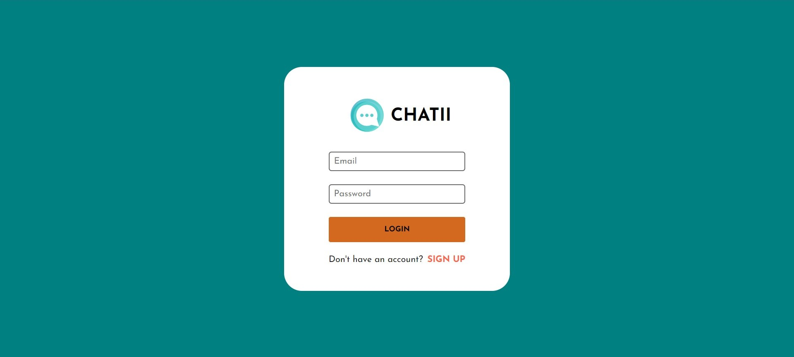
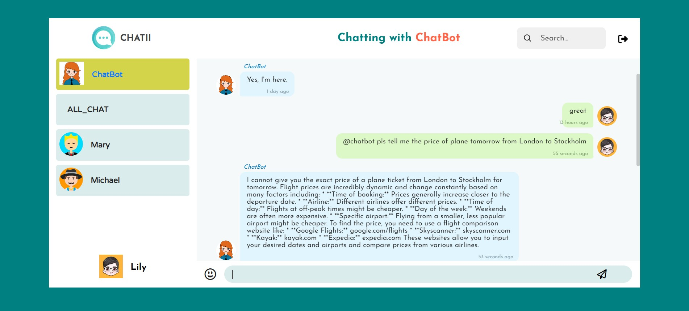
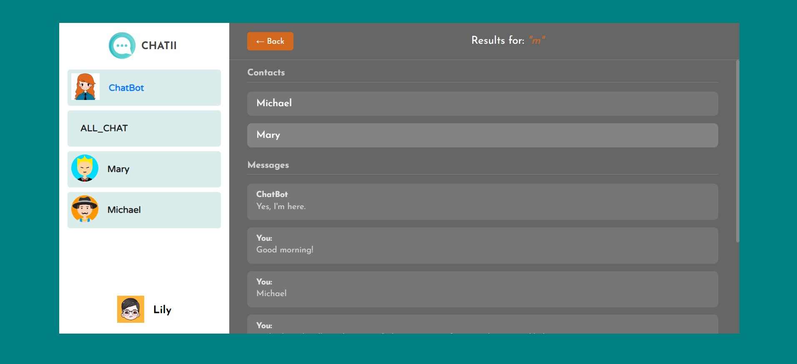
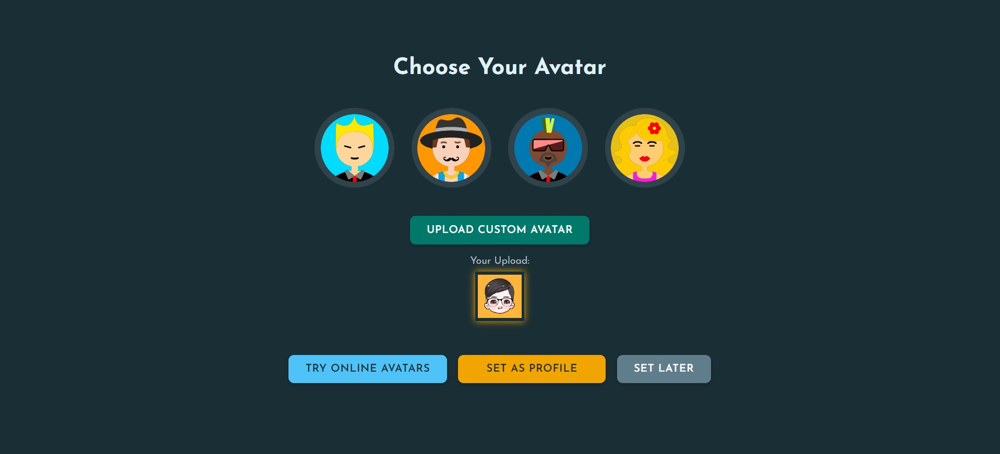

# Chatii - AI-powered Real-Time Chat Application

<!-- 

 -->

A real-time chat application built with the MERN stack (MongoDB, Express.js, React.js, and Node.js) and enhanced with Socket.io for real-time communication. It offers a dynamic and secure chatting experience, including intelligent AI interactions, custom avatars, and much more.

## 🛠 Tech Stack

This application is built using the following technologies:

- **Frontend**

  - **React.js**: Frontend library for building the user interface.

- **Backend**

  - **Node.js**: Server-side JavaScript runtime environment.
  - **Express.js**: Backend web framework for routing and API handling.
  - **MongoDB**: Database for storing user data, messages, etc.
  - **Socket.io**: Real-time communication between clients and the server.
  - **Bcrypt**: Password hashing for secure user authentication.

- **Deployment & Management**
  - **Docker Compose**: Containerization tool for managing multi-container Docker applications.

## ✨ Key Features

- **Instant Messaging**: Engage in real-time, one-on-one, and group conversations.
- **Public Channel**: Join and participate in open discussion forums.
- **AI-Powered Assistant**: Interact with an integrated AI chatbot for information and assistance.
- **User Authentication**: Secure registration and login system for user privacy.
- **Encrypted Storage**: Sensitive user data, such as passwords, stored securely.
- **Efficient Search**: Ability to search through chat history and user profiles.
- **Customizable Avatar**: Users can upload and set a custom avatar for their profile.

## Prerequisites

- Node.js and npm (Node Package Manager) installed on your machine.
- MongoDB installed and running.
- Gemini API key.
- Docker and Docker Compose installed (if using Docker).

## 🚀 Installation

1. **Clone the repository**
   ```bash
   git clone https://github.com/Shu-Shine/Chatii.git
   cd chati
   ```
2. **Install frontend dependencies**
   ```bash
   npm install # or yarn install
   ```
3. **Install backend dependencies**
   ```bash
   cd server
   npm install # or yarn install
   ```
4. **Configure environment variables**
   Create a .env file in the root directory and configure the following (example):
   ```env
   MONGODB_URI=your-mongodb_uri
   SESSION_SECRET=your-secret-key
   REACT_APP_LOCALHOST_KEY=your-localhost-key
   GEMINI_API_KEY=your-Gemini-API-key
   REACT_APP_BOT_USER_EMAIL=bot-email
   REACT_APP_ALL_CHAT_EMAIL=chatroom-email
   ```
5. **Start the application**  
   Start the frontend development server:
   ```bash
   npm start
   ```
   Start the backend server:
   ```bash
   cd server
   npm start
   ```
   Open your browser and navigate to the frontend URL (usually http://localhost:3000).
6. **Optional: Run with Docker**  
   Alternatively, you can run the application using Docker Compose:
   ```bash
   docker-compose up --build
   ```

## 📸 Screenshots

### Login Page



### Chat Bot



### Search Window



### Set Avatar


